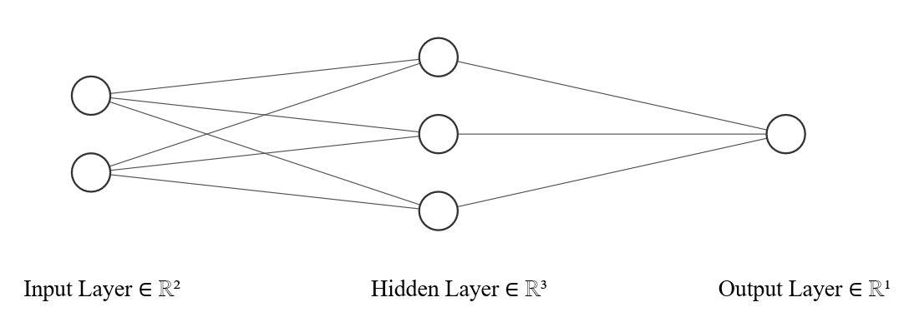

```{r setup, include=FALSE}
knitr::opts_chunk$set(echo = TRUE, fig.align = 'center')
```

**************

**************

**************

Please submit as a print-to-pdf of the knitted html document as `HW8 firstname lastname.pdf`.
Put you answers inside appropriate section headers in your document.
Ensure your first and last name is in the document title area.

Please look through your document and fix functions that span beyond the page width.

**************

**************

**************


# Theory
*******************


## [6 Points] Gradient Descent Pt1
**********************************

**How is repeated cross-validation an appropriate analogy for epoch, batch, and iteration? You may use numbers if it helps you explain.**
```{r, include = FALSE}
# Two points:
# An epoch is to the number of repeats

# Two points:
# A batch is to the number of folds

# Two points:
# Iterations are to the number of observations of each fold
```

## [9 Points] Gradient Descent Pt2
**********************************

**Compare and contrast the three different gradient descent algorithms we have covered with respect to:**

1. **Whether or not they converge**
2. **Their relative speed**
3. **Whether they can escape non-global minima**

**Points:** 3 algorithms $\times$ 3 characteristics = 9 points.

```{r, include = FALSE}
# Batch Gradient Descent
# 1. Yup
# 2. Slowest
# 3. Nope

# Stochastic Gradient Descent
# 1. Not in a million (or in infinity) years
# 2. Fastest
# 3. Yessir!

# Mini-batch Gradient Descent
# 1. Not happening
# 2. The middle child
# 3. Affirmative!
```

## [5 Points] Activation Functions
************************************
**What is the relationship between _output_ layer activation functions and** $\hat{y}$**?**

```{r, include = FALSE}
# The bounds of the activation function determine the bounds of yhat
```


# Neural Network Anatomy
*********************************************

**Directions:** The output should be from code chunks. You may find it helpful to first solve it by hand before coding the solutions. *I genuinely always do this for more involved coding problems*.

We are going to work with this neural network:



Here is our made-up data:

| Profit   | Step 1: Collect Pants | Step 2: ? |
|----------|-----------|----------------|
| -10      | 20        | -40            |
| 1        | 5         | 42             |
| $y_3$    | $x_{1,3}$ | $x_{2,3}$      |
| $\vdots$ | $\vdots$  | $\vdots$       |


Here are some weights:

| Layer  | Neuron | Input 1 Weight    | Input 2 Weight    | Input 3 Weight    | Bias        |
|--------|--------|-------------------|-------------------|-------------------|-------------|
| Hidden | Top    | $w^1_{1,1} = 0.3$ | $w^1_{1,2} = 0.4$ | *NA*              | $b^1_1 = 1$ |
| Hidden | Middle | $w^1_{2,1} = 0.1$ | $w^1_{2,2} = 0.6$ | *NA*              | $b^1_2 = 1$ |
| Hidden | Bottom | $w^1_{3,1} = 0.7$ | $w^1_{3,2} = 0.1$ | *NA*              | $b^1_3 = 1$ |
| Output | Yup.   | $w^2_{1,1} = 0.9$ | $w^2_{1,2} = 0.7$ | $w^2_{1,3} = 0.5$ | $b^2_1 = 1$ |


To make things a bit easier for you, use ReLU for the **hidden layer** activation function:

$$\text{ReLU}(z) = \begin{cases}
0 & \text{if } z \leq 0\\
z & \text{if } z > 0
\end{cases}$$


Use the swanky none function for the **output layer** activation function:

$$\text{none}(z) = z$$


Use the MSE for the cost function:

$$ C_k = (\hat{y}_k - y_k)^2$$

And let

$$\eta = 0.05$$

***********************

**OBJECTIVE:** Determine how much we will adjust $w^2_{1,3}$ and $b^1_2$ using a batch of two observations.
You will need to calculate the first iteration's $\frac{\partial C_1}{\partial w^2_{1,3}}$ and $\frac{\partial C_1}{\partial b^1_2}$.
I will give you the second iteration's $\frac{\partial C_2}{\partial w^2_{1,3}}$ and $\frac{\partial C_2}{\partial b^1_2}$.

*Tips: you are writing in RMarkdown! So use it! Create functions and objects to ensure you don't make mistakes with rounding.*


## [2 Points] Create ReLU
**************************

Create a function `r()` for ReLU. 
```{r, include = FALSE}
r = function(z){
  if(z <= 0){0}
  else{z}
}
```

## [8 Points] Create Base Objects
***********************************************

Create unique objects in `R` for the $y_1$, $x_{1,1}$, $x_{2,1}$, the respective weights and biases, and $\eta$.
```{r, include = FALSE}
# First observations
y1 = -10
x_11 = 20
x_12 = -40

# All biases
b1_1 = b1_2 = b1_3 = b2_1 = 1

# hidden layer - top
w1_11 = 0.3
w1_12 = 0.4

# hidden layer - middle
w1_21 = 0.1
w1_22 = 0.6

# hidden layer - bottom
w1_31 = 0.7
w1_32 = 0.1

# output layer
w2_11 = 0.9
w2_12 = 0.7
w2_13 = 0.5

# eta
eta = 0.05
```

## [6 Points] Evaluate Hidden Layer $z$s.
*******************************

Create unique objects for the hidden layer's $z$ values.
```{r, include = FALSE}
z1_1 = w1_11*x_11 + w1_12*x_12 + b1_1
z1_2 = w1_21*x_11 + w1_22*x_12 + b1_2
z1_3 = w1_31*x_11 + w1_32*x_12 + b1_3
```

## [4 Points] Evaluate Output Layer $z$s
**************************

Using the defined values of $z$ above, calculate $z^2_1$ using `r()`.
```{r, include = FALSE}
z2_1 = w2_11*r(z1_1) + w2_12*r(z1_2) + w2_13*r(z1_3) + b2_1
```

## [4 Points] Print $\hat{y}_1$
******************************************

Calculate and print $\hat{y}_1$. 
```{r, include = FALSE}
(yhat_1 = z2_1)
```

## [4 Points] Print $\frac{\partial C_1}{\partial w^2_{1,3}}$
************************

Using the chain rule, evaluate and print $\frac{\partial C_1}{\partial w^2_{1,3}}$.

```{r, include = FALSE}
(  dc_1.dw2_13 = (2*(yhat_1 - y1))  *  1  *  r(z1_3)  )
```


## [4 Points] Print $\frac{\partial C_1}{\partial b^1_2}$
************************

Using the chain rule, evaluate and print $\frac{\partial C_1}{\partial b^1_2}$.

```{r, include = FALSE}
(  dc_1.db1_2 = (2*(yhat_1 - y1))  *  1  *  w2_11  *  0  *  1  )
```

## [8 Points] The First Batch
*****************************
If your code is correct, you can verify $\frac{\partial C_2}{\partial w^2_{1,3}} = 703.134$ exactly and 
$\frac{\partial C_2}{\partial b^1_2} = 56.574$ exactly.

To wrap up this problem, by how much do we adjust $w^2_{1,3}$ and $b^1_2$ by respectively after our first tiny batch?

```{r, include = FALSE}
# Minus half points if eta was forgotten in w^2_{1,3}

# w^2_{1,3} changes by:
-eta*mean(c(dc_1.dw2_13, 703.134))

# b^2_1 changes by:
0 # = -eta*mean(dc_1.cb1_2, 0)
```


# Application
***********************************

Two important notes before we get going:

1. Your output layer activation function must match the bounds of the variable of interest. I will refer you to the lecture materials.
2. Remember that while we technically can set the seed, we are not going to. I will refer you to Google.

In this section, you have constrained freedom to choose models.
You get to construct two different neural networks (one shallow and one "deep"), with a list of requirements.
If you are familiar with advanced neural network architectures that we did not discuss in class, you may use it for the second model.

**Requirements**

1. Both models must predict the same value from the HW data. You may choose `ftotval`, `lf`, or `degree`.
2. Your training sample should be set to 75%
3. The first model must have one hidden layer & the second must have more than one hidden layer.
4. You can use any combination of variables on the RHS
5. You must print the summary of the model
5. You can use any number of neurons in the hidden layers between 30-300
6. You can choose the number of epochs, batch size, and validation split, but both models must have the same values
7. You must plot the history of the fit for both models
8. You must print the evaluation for both models

I will remind you of this in each sub-subsection.

```{r NN setup, eval = FALSE}
library(tidyverse)
library(keras)

cps = read.csv("C:/Users/johnj/Documents/Data/Applied ML ECON490/hw data/hw data.csv")
cps = cps %>%
  mutate(id   = rownames(cps))

train = sample_frac(cps, @@@@@)
test  = anti_join(cps, train, by = "id")

f = y@@@@@ ~ x@@@@@
  
x_train = model.matrix(f, train) %>% scale
x_test  = model.matrix(f, test) %>% scale

# Recall if you are predicting a categorical variable, it needs to be zero indexed
# and you need to initialize it with the keras function to_categorical()
y_train = @@@@@
y_test  = @@@@@
  
head(y_train)
```


## Model 1
********************

Remember that this model should only have one hidden layer.

### [6 Points] Define the Model
****************************

Set up single hidden layer neural network.

You may use any activation function in the hidden neurons.
You may use any number of hidden neurons between 30-300.
The bounds of your output layer activation functions should match your outcome variable.
```{r mod1 initialization}
# Your code here
```

Print the summary
```{r mod1 summary}
# Your code here
```

### [2 Points] Compile the Model
******************************
If you have chosen a regression problem, set the `loss = "mean_squared_error"` or `loss = "mean_absolute_error"` with a `metrics` set to match.

If you have chosen a classification problem, set `loss = "categorical_crossentropy"` and `metrics = c("accuracy")`.

In both cases, set `optimizer = optimizer_rmsprop()`.

```{r mod 1 compile}
# Your code here
```

### [6 Points] Training the Model
****************************

You can choose the value for `epochs`, `batch_size`, and `validation_split`, but it must match in both models.

```{r mod 1 fit}
# Your code here
```


Plot the history
```{r mod1 plot}
# Your code here
```

### [2 Points] Evaluate the Model Performance
*********************

Following the lecture materials, use `evaluate(x_test, y_test)` to print the model performance.

```{r mod1 evaluation}
# Your code here
```


## Model 2
********************

Your second model should have more than one layer. 
There is no official threshold for deep learning, so I suppose a plural amount of hidden layers will do.

### [6 Points] Define the Model
****************************

Set up multi-hidden layer neural network.

You may use any activation function in the hidden neurons.
You may use any number of hidden neurons between 30-300.
The bounds of your output layer activation functions should match your outcome variable.
```{r mod2 initialization}
# Your code here
```

Print the summary
```{r mod2 summary}
# Your code here
```

### [2 Points] Compile the Model
******************************
Use the same compile arguments as the first model.

```{r mod 2 compile}
# Your code here
```

### [6 Points] Training the Model
****************************

You can choose the value for `epochs`, `batch_size`, and `validation_split`, but it must match in both models.

```{r mod 2 fit}
# Your code here
```


Plot the history
```{r mod2 plot}
# Your code here
```

### [2 Points] Evaluate the Model Performance
*********************

Following the lecutre materials, use `evaluate(x_test, y_test)` to print the model performance.

```{r mod2 evaluation}
# Your code here
```

## [8 Points] Comparison
***************************

**Did one model perform significantly better than the other? If so, which one? _IT IS OKAY IF IT DOESN'T MATCH YOUR FINAL KNITTED DOCUMENT._**

Your answer here.


