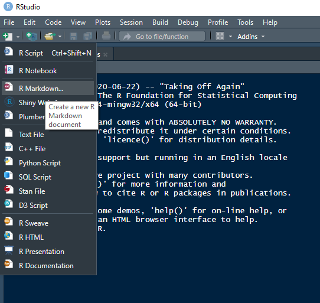

```{r setup, include=FALSE}
knitr::opts_chunk$set(echo = TRUE)
```

Open a new markdown:



Explore around what types of markdowns you can make.
Then select an html document.
Knit this document by typing `Ctrl-Shift-k`

Now you may follow this document


# Section 1
***
## This will one.one
### not 1.1.2
#### Not in table of contents

# RMarkdown Basics
**********************************************************
Here are some fundamentals to writting in RMarkdown.

## Writing text
**********************************************************
This is how to write text in RMarkdwon.
Notice writing on the next line stays in the same paragraph.

This is how you start a new paragraph.
Wrap you words in \* to get *italics*.
Using two \*s will produce **bolface**.
There are other things that we can do too, like making lists.

1. Item 1
2. Item 2
   b. Notice how we had to align in the RMarkdown code
      - You can choose whether you use numers. or letters. but RMarkdown chooses the symbols for you :(


This is how we reference inline code like `R`'s base function `plot` is as pretty as `ggplot2`'s function `ggplot`.

To write math, we can use some limited `latex` features.
Like if we wanted to show a regression formula inline:
$y_i = \alpha + x_i\beta + \epsilon_i$.
Alternatively, if we have important math like the geometric series identity, we can make it stand out:
$$
2^2 = 4\\
\begin{align*}
  \sum_{n=0}^\infty ar^n & = a \left( \frac{1}{1-r} \right)\\
  & = \frac{a}{1-r}\\
  & \text{for } |r| < 1
\end{align*}
$$

If we want to link sections, we do this [Section 1].
Or if we need to link a website, we do this while making sure to include https.
A really useful [resource](https:/www.bookdown.org/yihui/rmarkdown) for additional RMarkdown tips and tricks.


This is how we include images in our markdown.


## Writing Code
Here is the basic to writing code chunks.
```{r hello}
print('hello world')
```

#@@@@ RUN INSIDE SCRIPT

The first part of the curly braces tells you what language you are using and the name of the chunk.
Then options can be set up using commas after the chunk name by setting them to `TRUE` or `FALSE`.
Some major options all of which have default of `TRUE` are:

- `include` - Whether or not to be included in the document
- `echo` - Displays the code
- `results` - Displays the output of the code
- `messages` - Display messages from the functions if they have them.

#@@@@
#@@@@
#@@@@
#@@@@ Some general advice. Copy and paste into word. Typos, not a native language, or if you are native but sometimes english is really hard.
#@@@@
#@@@@
#@@@@


# An example assignment
**********************************************************
We must do the following:

1. load ggplot2
2. load in gapminder_2007
3. produce a correlation matrix
4. obtain mean and standard deviation of the America's GDPc
5. Summary stats of life expectancy for countries with GDPC less than $10,000
6. Replicate plot from last lecture

## Load in ggplot2 and gapminder_2007
**********************************************************
```{r preliminary, include = FALSE}
library(ggplot2)
gm = read.csv('C:/Users/johnj/Documents/Data/Applied ML ECON490/lecture data/gapminder_2007.csv')

```
Done, but I am not going to show you!

## Produce Three Sets of Statistics
**********************************************************
Here is a correlation matrix GDP per capita, life expectancy, and population.
```{r cor mat, echo = FALSE}
cor(gm[, c('gdpPercap', 'lifeExp', 'pop')])
```

Here is the mean and standard deviation of the America's GDP per capita.
```{r m sd americas}
americas = gm[gm$continent == 'Americas', ]
m = mean(americas$gdpPercap)
m = round(m, 2)
s = round(sd(gm[gm$continent == 'Americas', 'gdpPercap']), 2)
print(paste0("Americas' mean: ", m))
print(paste("Americas' standrad deviation:", s))
```
And finally here are the summary statistics of life expectancy for countries with less than $10,000 gdp per capita
```{r poor stats}
summary(gm[gm$gdpPercap < 10000, 'lifeExp'])
```

## Replicate Last Lectures Plot
**********************************************************
Here is the plot we already made.

```{r eda, echo = FALSE}
ggplot(gm, aes(x = gdpPercap, y = lifeExp, color = continent, size = pop)) +
  geom_point() +
  scale_size_continuous(guide = 'none') +
  scale_color_discrete(name = 'Continent') +
  theme_minimal() +
  labs(x = 'GDP per Capita (USD)', y = 'Life Expectancy (years)', title = 'GDPc vs Life Expectancy')
```


