# Downloads {#top}
*************


To get started

1. Download Git - [https://git-scm.com/downloads](https://git-scm.com/downloads)
2. Download Atom - [https://atom.io/](https://atom.io/)
3. Create a GitHub account [https://github.com/join](https://github.com/join)
   - You will eventually lose access to your university email, so I recommend using your personal email
   - Record your username and user email

# Atom Setup
*************************

Open Atom. 
If you do not see a windowpane on the left with a title of "Project", go to View > Toggle Tree View.

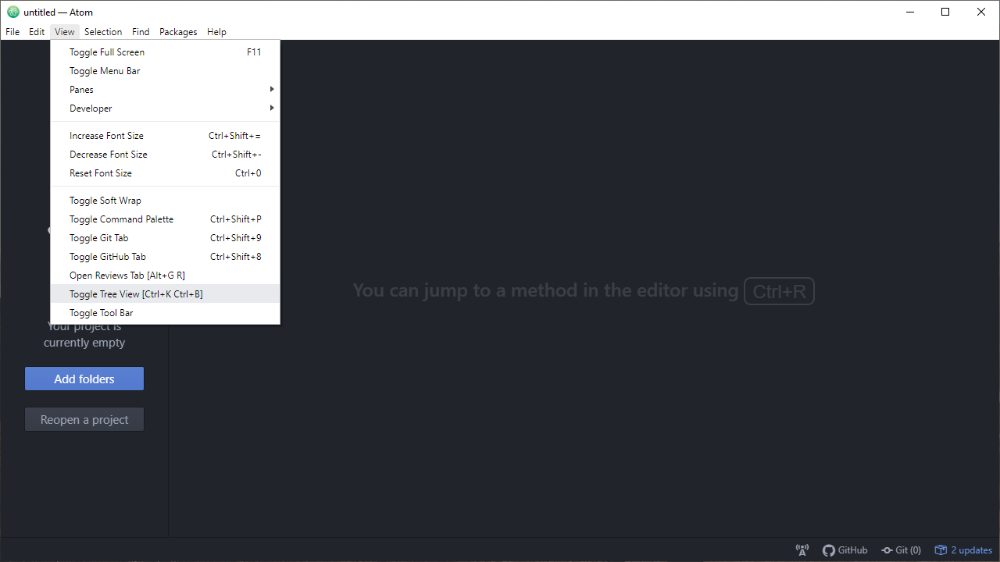

The next thing we need to do is add a markdown preview package. Go to File > Settings > + Install and search for `markdown-preview`. Scroll down for the one made by Atom. Install.

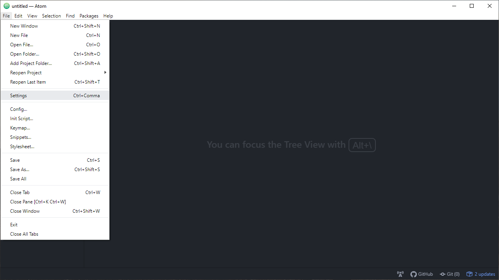
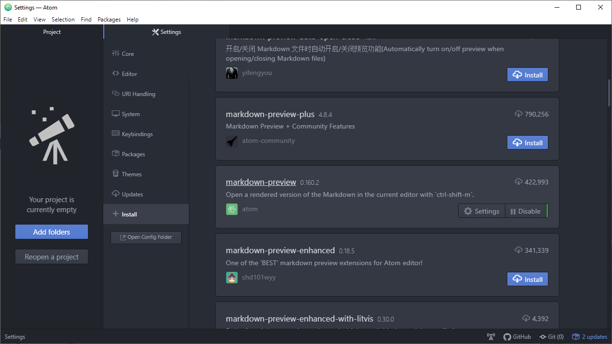

# Git
**********************

[Top](#top)

Open the program Git Bash.

- Mac - in your application folder
- Windows - press Windows a type in Git Bash.

A terminal should appear.
This is essentially your file explorer, but we are using commands to navigate.

## Terminal Command
**********************************

[Top](#top)

Here are the commands we will be using. See the code below for examples.

| Command | Description               |
|---------|---------------------------|
| Ctrl-Insert | copy|
| Shift-Insert | paste |
| `pwd`   | path to working directory |
| `cd` | change directory |
| `ls` | list files and folders |
| `dir` | show directories | 
| `mkdir` | make directory |
| `rmdir` | remove directory |
| `touch <file.extension>` | create empty file.extension |
| `echo "text to insert" > file.extension` | create/overwrite file.extension containing "text to insert". |
| `echo "text to append" > file.extension` | append "text to append" to file.extension |


## Initializing Git
***************************

[Top](#top)

The first thing to do is check you have correctly installed Git.

```{git}
git --version
```

This produce `git version 2.27.0.windows.1` on my computer.

Now we get to set up our profile.
This should match your GitHub account exactly.

```{g}
git config --global user.email jjpwade2@illinois.edu
git config --global user.name julianwadeoolman
git config user.name
git config user.email
```


## Navigating the Terminal
***

[Top](#top)

Where are we and what files are there?

```{g}
pwd
ls
dir
```

Let's head to a new location.
```{g}
cd Desktop
pwd
ls
```

Ahh! I don't like it here. Let's go **back** **up** with a **dot dot**.

```{g}
cd ..
pwd
```
Okay, maybe it wasn't so bad. 
Let's go back to the desktop and **make a folder** called `doodle`.

BUT I AM LAZY. I don't want to type out `Desktop` again. I will just type out enough and then press `Tab`.

```{g}
cd Des...Tab
mkdir doodle
ls
```
That's a nice folder and all, but let's delete it.

```{g}
rmdir doodle
ls
```
$$Poof$$
I miss it already! 
Let's get it back.
Press the up-arrow key until you see the command `mkdir doodle`. Then press `Enter`.

There is an alternative way that we can jumpy to any directory on our computer:

```{g}
cd "C:/Users/johnj/Desktop/doodle"
pwd
```

*Note that if you want to navigate to a directory with a space in its name, you must wrap the path with* `""`.

## Making a Repository
*****************************

[Top](#top)

Now that we are in the folder `.../doodle`, we are going to create our first repository!
Every GitHub page has a `README.md` file that tells visitors what the repo is about.
For our toy repo, we will make:

1. a readme file
2. a Python function
3. a *tiny* data set

Let's create the repository, create the readme file, and open it with Atom.

```{g}
git init
touch README.md
ls
atom README.md
```

Excellent! Now we have a blank readme file!
While we are at it, why don't we add our repo to Atom.
On the project pane on the left, click the blue `Add folders` button.
Navigate to the `.../doodle` folder and the `Select Folder`.

If you don't see the project pane, got to View > Toggle Tree View.

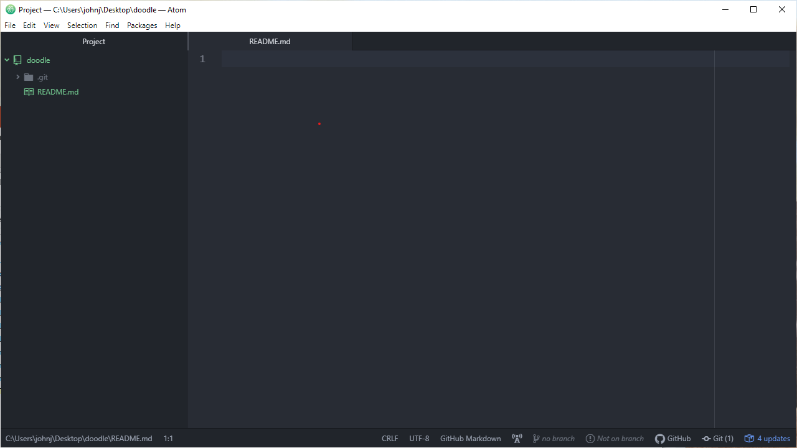


You can tell we are in a repository because the folder is green! Good to go!

Let's remove `README.md`.

```{g}
rm README.md
ls
```
Ah! It is gone!

Navigate back over to Atom. Notice it is missing from list of files.
Fortunately, there is still a `README.md` open, but it is not saved.

Let's pretend it isn't there and create a new one.
```{g}
touch README.md
atom README.md
```
And here we are.

We can also have subdirectories in our repositories.
Let's create one: `.../doodle/data`

```{g}
mkrdir data
ls
cd data
```

Now that we are here, we are going to make a baby data set. 
Specifically, we are going to make a comma-separated values (CSV) file containing our date.

```{g}
touch historical_text.csv
atom historical_text.csv
```
Here is the data we are going to put into it:

```
Year, Document
1776, The Wealth of Nations
```

Save the file in Atom using `Ctrl-s`.

## Staging
**************************

[Top](#top)

Now that we have made some *awesome* changes, we should add them to the staging area.

```{g}
cd ..
git status
```
You can see that 

1. we are on the master branch
2. there are no commits yet
3. we have two untracked files: `REAME.md` and `data/`

Let's add them to the staging area.

```{g}
git add README.md
git add data/
git status
```

We can see that they have been added.

$$\text{But Wait!}$$
We should add a title to our readme.
```{g}
git rm --cached README.md
git rm --cached "data/historical text.csv"
```
We will create a section and a description in the `README.md`.
```
# Doodle

An *awesome* repository!
```

For a preview, press `Ctrl-Shift-m`. 
It will likely fail the first time, so press the keyboard shortcut again twice.

Save it and away we go! To save typing it two lines, let's just use one:
```{g}
git add README.md data/
```
We can also remove them in one line:
```{g}
git rm --cached README.md "data/historical text.csv"
```

But **what if we have a ton of files?**

Well, there is a shortcut!
```{g}
git add .
git status 
git rm --cached . -r
```
The `-r` stands for recursive. 
It tells git to remove files until there are none left to remove.


## Committing
****
[Top](#top)

Enough messing around! Let's make our first commit!

Whenever you make a commit, it is always important to **leave a terse, descriptive message** describing what was done since the last save. 
We do so by specifying the option `-m`.

```{g}
git add .
git commit -m "Added readme and historical document data"
git log
```

OUR FIRST COMMIT! AWESOME!

Hey, what if we wanted the log on one line?
```{g}
git log --oneline
```
That gives us a tidier log. 
Notice the commit id has been abbreviated.

Wasn't that fun? 
Let's do two more for practice!
```{g}
echo "print('hello world')" > hello.py
atom hello.py
```
Our first Python function!
We must save that!
```{g}
git add .
```
```
warning: LF will be replaced by CRLF in hello.py.
The file will have its original line endings in your working directory
```
Huh, that's weird.
It is just Git telling us that it will be making some changes under the hood that does not affect us in anyway at all.
If you are curious, you are welcome to Google it and learn more about Unix.
```{g}
git commit -m "added hello world script"
git log --oneline
```
How about adding a table of contents to our readme?
```{g}
atom README.md
```
```
#### Table of Contents
* [About](#About-this-repo!)
# About this repo!
```
`Ctrl-s`
```{g}
git add .
git commit -m "added table of contents to readme"
git log --oneline
```

## A Journey Back in Time
****

[Top](#top)

What if we are doing some work for our boss?

* Boss: Do A for our project
* You: Does A
* Boss: Neat! Now can you add B?
* You: Add B
* Boss: What if we could also add C?
* You: Add C
* Boss: I HATE IT! Just go back to A and forget it!
* You: WTF!!!!!

Fortunately, you made commits of you work at each checkpoint.

### `checkout`


`checkout` is a way to just look at the code you had before.
It is the safest of the options we are exploring to go back in time.
Let's go back to our *first commit*.
For me, it has the short id `ff52afd`. **It will be different for you**.

```{g}
ls
git checkout ff52afd
ls
```
If you notice in Atom, our `README.md` file has changed.
We still have our data.
There is also a now unsaved tab that is our `hello.py` script that we have yet to make. 
It's just hanging out in the ether, as you do.

Well, that was enough fun poking around. Time to go back before we kill a butterfly.

```{g}
git checkout master
ls
```

### `revert`

Reverting is for adding a new commit that is identical to a past commit.
For demonstration purposes, let's go back to our second commit.
That is, the one where we made out hello world script.

```{g}
git revert 7257439
````
AHH! A new screen has popped up! Whatever will we do?!?!

It will all be okay! Type `:` followed by `wq` then press `Enter`.
This tells Git we want to `w`rite the revert as a commit and `q`uit the interface.
```{g}
:wq
git log --oneline
```

### `reset`

Welcome to the danger zone! 
It is dangerous because we cannot undo a reset.
There are two options with `reset`

1. Consolidate commits
2. Delete most recent changes

Let us go back to our third commit, where we added our table of contents.

```{g}
git reset cf1f4cc
git log --oneline
git status
```
It tells us that there are upstaged changes. 
It has kept the files from before.
This is how we can consolidate our commits.
From here we would stage and commit.

Secondly, we can delete backwards in time. This is a **hard reset**.
```{g}
git reset cf1f4cc --hard
git log --oneline
git status
```

## Branches
***

[Top](#top)

The master or main branch is for our production code.
We may want to test out some new code, without the risk of damaging the production code.
To do so, we can check out a new branch.


```{g}
git branch analysis
git branch -a
```

We can see that we were successful creating this branch. 
```{g}
git checkout analysis
git branch -a
```

What if we **want to delete a branch**? 
First you need to *leave* the branch.
Don't want to get caught on a branch that you are about to saw off!

Then you need to pass either the option `-d` or `-D`

* `-d` - delete branch **only if** it has been merged
* `-D` - **scorched earth** deletion (will delete unmerged files: gone forever)

Let's be cautious with our delete
```{g}
git checkout master
git branch -d analysis
git branch -a
```

Anyway, back to business. Let's recreate a branch with the same name and head over in one line.
While we are there, how about we make a function and make our hello world script grammatically correct AND a function!

```{g}
git checkout -b analysis
atom hello.py
```
```
print("'Hello, world!' said Python.")
```
Save that!
```{g}
touch exp,py
atom exp.py
```
```
def exp(x,y):
  return(x**y)
```
Save that!
```{g}
git add .
git commit -m "made hello.py a grammatically correct function and added exp.py function"
git log --oneline
git checkout master
git log --oneline
```

Tadah!

## Merging
***
[Top](#top)


Hokay, so we have our test code and want to merge it back to the master branch.
But suppose some doofus decided to update the hello.py on the master branch to make it a function and grammatically correct?
Let's be that doofus.

**FIRST CLOSE THE hello.py IN ATOM**
```{g}
atom hello.py
```
```
def hello():
  print('"Hello, world!" said Python.')
```
Save that!
```{g}
git add .
git commit -m "made hello.py a function and grammatically correct"
```
What a doofus!

Now the *intelligent* person has successfully tested their code and wants to update the production code.
So, they try to merge 


```{g}
git merge analysis
```
Oh no! There is a conflict!

```{g}
cat hello.py
```
```
$ cat hello.py
<<<<<<< HEAD
print('"Hello, world!" said Python.')
=======
def hello():
  print('"Hello, world!" said Python.')
>>>>>>> analysis
```
It shows us on the top that some doofus has made some silly code. 
Ours is clearly superior! 
We want to overwrite theirs with ours.
We can either do that manually or use our lovely pall Atom.
```{g}
atom hello.py
```
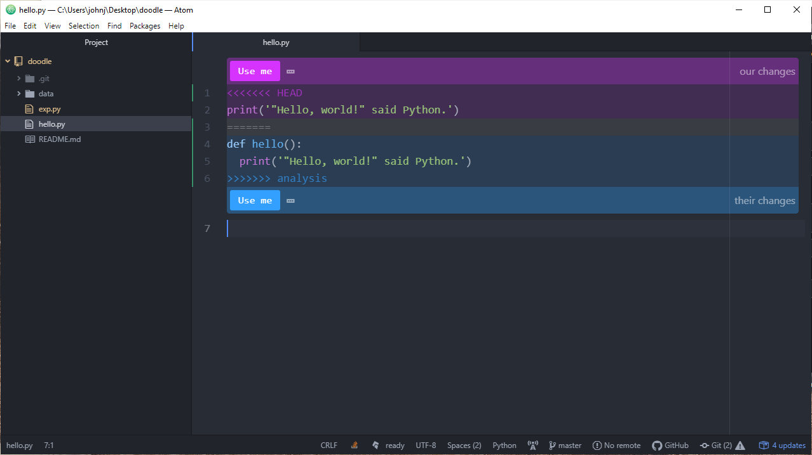

The bottom code is our superior code. 
Click the bottom, blue Use me.
Save it!

```{g}
git add .
git commit
:wq
git log --oneline
```

Well, there is nothing more to it!
Since we are done with the analysis branch, we should tidy up and delete it!

```{g}
git branch -a
git branch -d analysis
git branch 0a
```


# GitHub
***
[Top](#top)

GitHub is a website that hosts repositories online to share with others. 
You have the option to create free public or private repos that can store up to 1GB of code/data.
There are two ways to create a GitHub repo: pushing up an existing local repo or initializing the repo on GitHub itself.
I almost always do the second option, but it is good to show you how to do both.

## Method 1: Existing Local Repo
***

On your home page, click the new button.

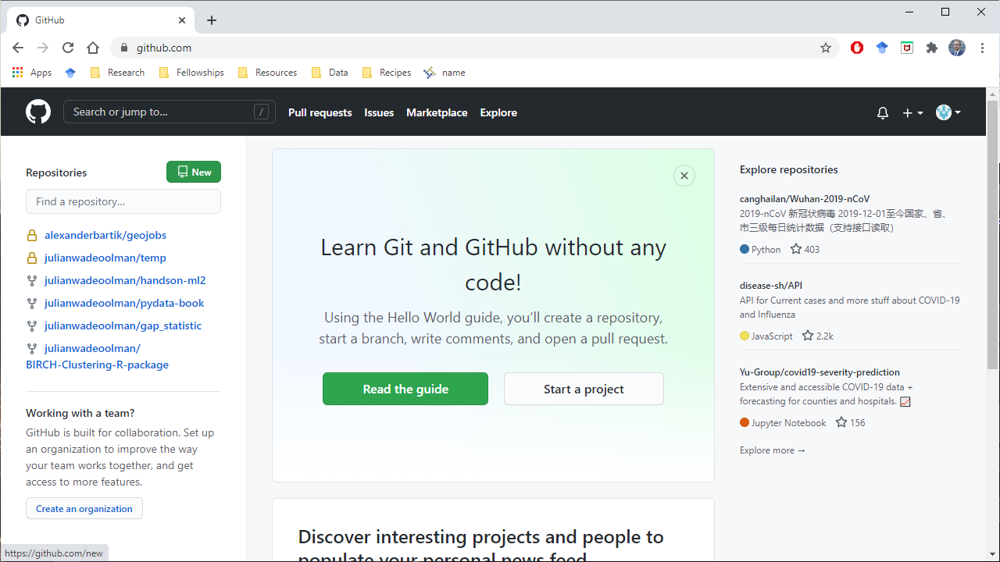

After clicking the new button, we will add in the repository name.
We are going to give it the same name as the repo that we have on our local machine for consistency.
You are also welcome to make it public or private.
We are going to delete it in a bit, anyway, so it is up to you.

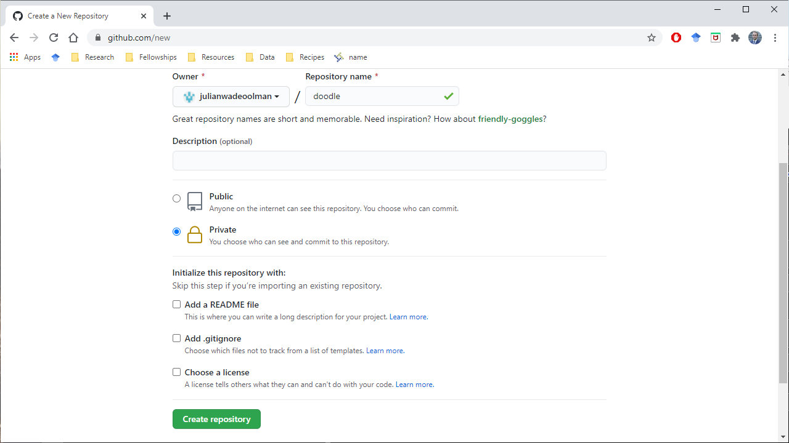

There are additional files that you can create when you initialize the repo.

1. a readme file
   * We have already made one
2. a .gitignore file 
   * Ignore system files from specific programming languages
3. a license
   * I never use a license, but you can read more about them if you want

**DO NOT ADD ANY OF THESE FILES**. We have an existing repo, so it doesn't play nicely with GitHub when you try to push your files to GitHub.

Click Create repository.


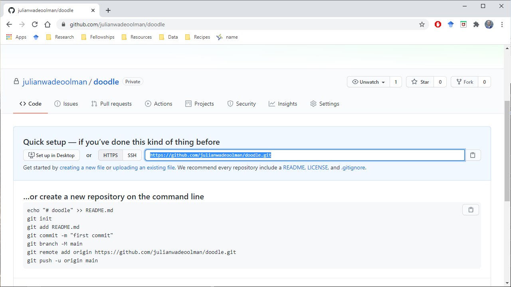

Copy the highlighted path to your clipboard and ignore the rest below.

Now we can push up our code! First, it is always good practice to ensure all files have been committed.
```{g}
git status
git push https://github.com/julianwadeoolman/doodle.git master
```

Head back over to GitHub and click on the `/doodle` shown in the previous screen shot.
There is your code!

Right above the sub window where it shows the data folder and your files, you can see your commit history.
There are many other things you can explore.

Now go under the settings tab and click on the Manage access tab on the left. 
You will be creating a repo for your workshop group to push your code (one repo per group).
After each workshop, you must upload it to receive credit.
**You must invite me and the TAs to your workshop group's repo.**

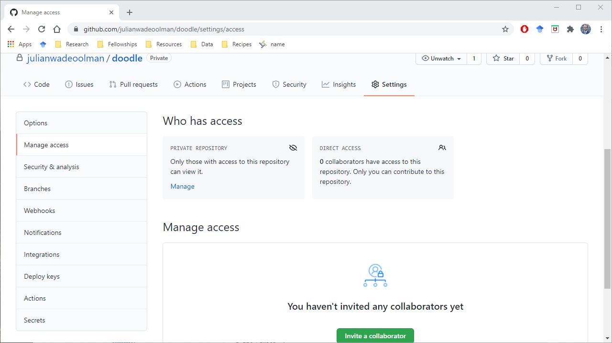


From here, you can modify your code on your local repository and push up to GitHub.
Alternatively, you can pull.
We will showcase grabbing files from GitHub in the next method.

For now, click on the options tab with settings and scroll to the bottom.
Delete this repository.
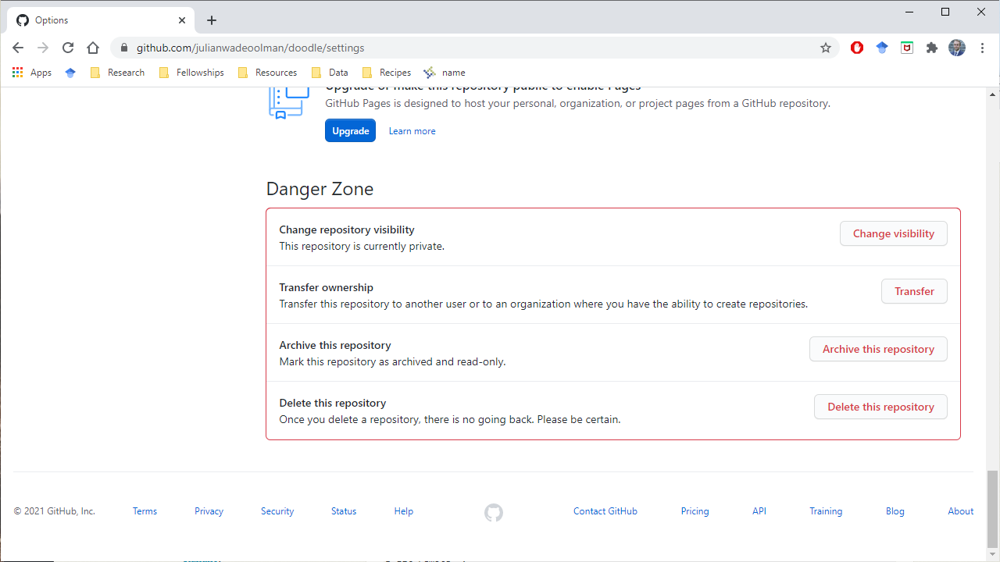


## Method 2: Initialize Repo on GitHub
***
[Top](#top)

Go through the same motions as before of creating a repo. Call it `doodle2`.
Make it public or private.
This time

1. Add a REAME file
2. Add .gitignore for Python
3. If you really want to, add a license. I am not going to give you any advice on this. I personally never add a license, but I only work for myself.

Create the repo.

Click the code dropdown menu and copy the hyperlink to your clipboard (you can just click the button right of the highlighted text).


Go back to your git interface.

```{g}
cd ..
ls
git clone https://github.com/julianwadeoolman/doodle2.git
ls
cd doodle2
```
Notice the production code branch is now called main.

A final note on pushing and pulling to GitHub. 
**It is a pain** to copy and paste the URL into the Git interface. 
If only there were a better way.
```{g}
git remote -v
```
```
$ git remote -v
origin  https://github.com/julianwadeoolman/doodle2.git (fetch)
origin  https://github.com/julianwadeoolman/doodle2.git (push)
```
Because we have initialized the repo on GitHub, it has made a remote repository for us called origin.
Let's go back to our original `.../doodle` repo
```{g}
cd ..
cd doodle
git remote -v
```
There is nothing (this has nothing to do with deleting the repo on GitHub)!
If we want to add our GitHub repo (which we deleted), we do so by:
```{g}
git remote add origin https://github.com/julianwadeoolman/doodle.git 
git remote -v
```
I am calling the name of the remote repo `origin` for the sake of matching GitHub’s convention, but you can call it whatever you want.
Pushing there will do nothing because we deleted the online repo.
But *if it did exist*, we would push to it by using `git push origin master`

## Collaboration
***
[Top](#top)

When collaborating on GitHub, there is an etiquette to follow:

1. Pull `main` branch from GitHub
2. Create a new branch from your new code
3. Push the branch you were working on to GitHub
4. Merge your branch to the `main` branch via GitHub

Following this procedure prevents any unnecessary conflicts or deleting code by accident.
To demonstrate, go back to doodle2
```{g}
cd ..
cd doodle2
git checkout -b blah
echo "blah" > blah.txt
git status
git add .
git commit -m "blah, blah, blah"
git push origin blah
```

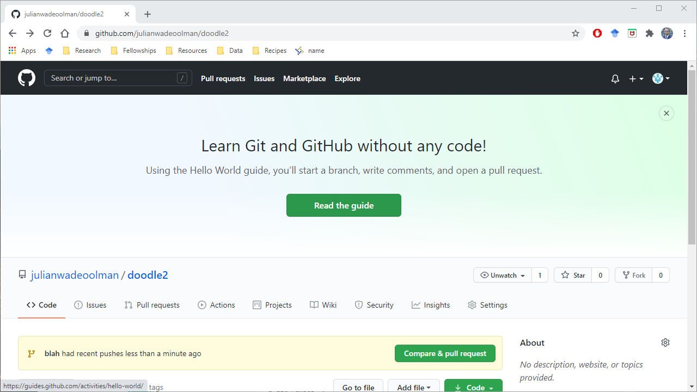
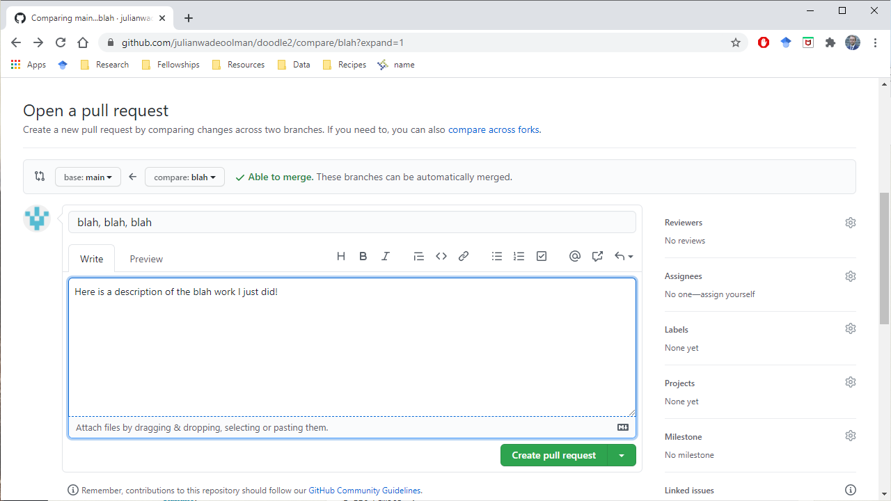

If this were actual code and not a text file you can leave comments on each line of code if you would like.

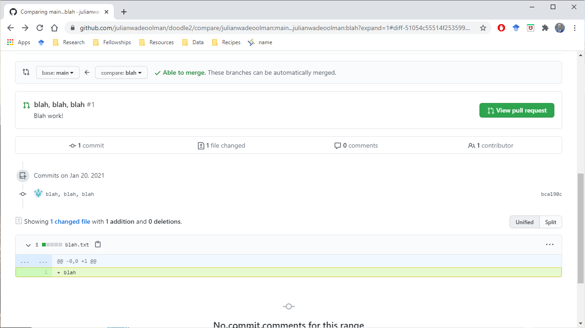

Then we can leave a comment and merge the pull request.

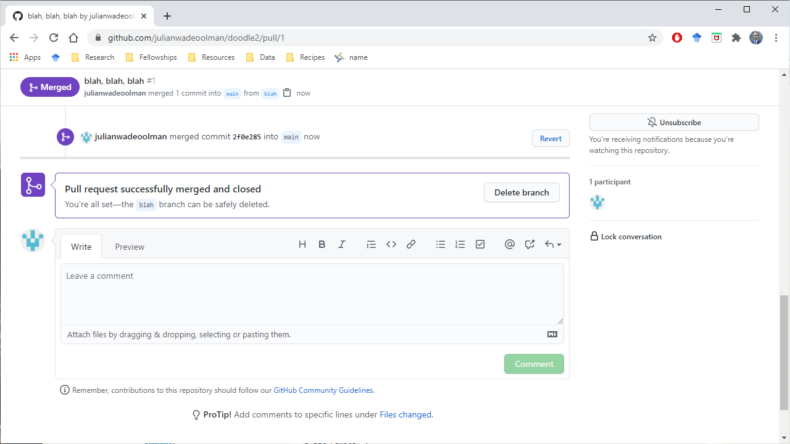


## Contributing
***
[Top](#top)

We will close our GitHub lecture by discussing contributing on GitHub.
Suppose there is someone out there working on code that you think you can make better.
They have open sourced it by making it publicly available on GitHub.
In comes the fork.
For example, here is the repo containing the code used to create our textbook: https://github.com/ageron/handson-ml2

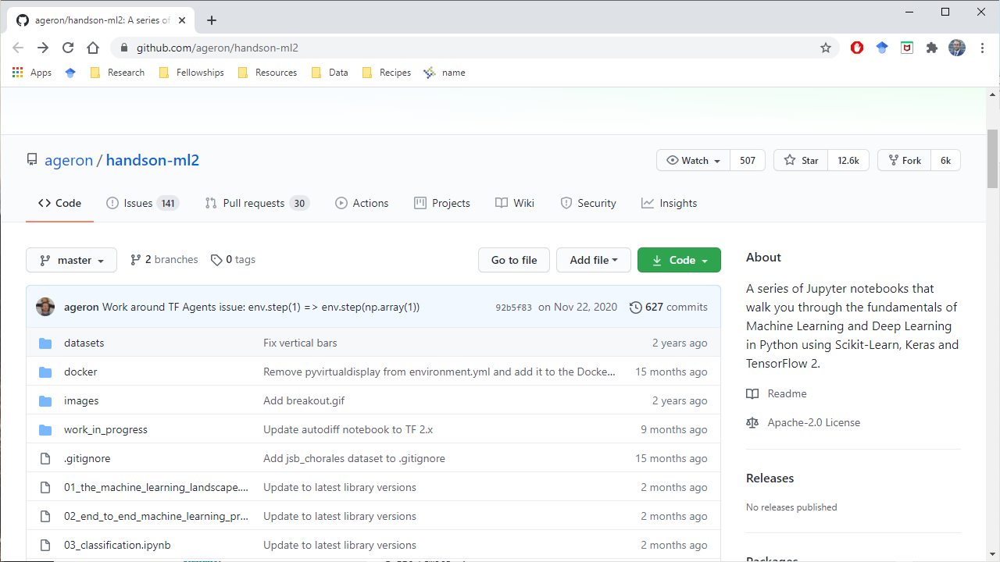

On the top right page, click the Fork button.
Doing so adds the repo to your account. 
From there you can download it to your local machine and make changes to the existing code.
Once you are satisfied that you have fixed the code, then you go back to the original repository that you forked.
You click on the Pull requests tab and create a New pull request.
If the author likes what you have done, then you get to see your name forever stamped into the commit history.
Kinda neat!


